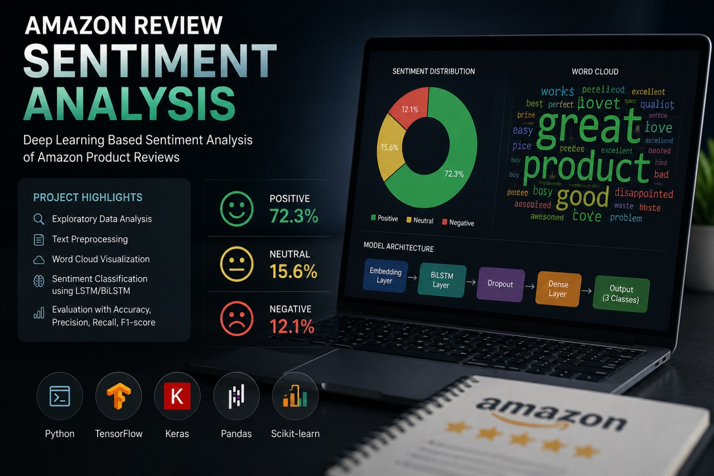

<p align="center">
  
</p>

<h1 align="center">Sentiment Analysis on Amazon Reviews</h1>

<p align="center">
Deep Learning-based Sentiment Analysis using Amazon Product Reviews.
</p>

<p align="center">


</p>

---

# 📖 Overview

This project performs **Sentiment Analysis** on Amazon product reviews using **Natural Language Processing (NLP)** and **Deep Learning** techniques.

The project includes:

- Data exploration (EDA)
- Text preprocessing
- Word Cloud visualization
- Sentiment classification
- Deep Learning model training
- Model evaluation

---

# 📂 Dataset

The dataset contains Amazon product reviews with fields such as:

- Review Text
- Rating (Overall)
- Summary
- Vote
- Verified Purchase
- Reviewer Name
- Review Time

Ratings are converted into sentiment classes:

| Rating | Sentiment |
|---------|-----------|
| 4–5 | Positive |
| 3 | Neutral |
| 1–2 | Negative |

---

# 🚀 Features

- Data Cleaning
- Text Normalization
- Stopword Removal
- Word Clouds
- Distribution Analysis
- Deep Learning Classification
- Performance Evaluation

---

# 🧠 Deep Learning

The model is implemented using TensorFlow/Keras.

Typical pipeline:

```
Text
   ↓
Cleaning
   ↓
Tokenizer
   ↓
Padding
   ↓
Embedding
   ↓
BiLSTM / LSTM
   ↓
Dense Layer
   ↓
Softmax
```

---

# 📊 Exploratory Data Analysis

The project includes:

- Rating Distribution
- Word Clouds
- Review Length Distribution
- Class Balance Analysis

---

# 🛠️ Tech Stack

- Python
- Pandas
- NumPy
- Matplotlib
- NLTK
- WordCloud
- Scikit-learn
- TensorFlow / Keras

---

# 📈 Results

The model is trained to classify reviews into:

- Positive
- Neutral
- Negative

Performance is evaluated using:

- Accuracy
- Precision
- Recall
- F1 Score
- Confusion Matrix

---

# ⚙️ Installation

```bash
git clone https://github.com/yourusername/Sentiment-Analysis.git

cd Sentiment-Analysis

pip install -r requirements.txt
```

---

# ▶️ Usage

```bash
python src/train.py
```

or

```bash
jupyter notebook
```

---

# 📜 License

This project is released under the MIT License.

---

# 🤝 Contributing

Contributions are welcome.

Please read **CONTRIBUTING.md** before submitting a Pull Request.

---

# 🔒 Security

If you discover a security issue, please read **SECURITY.md** before reporting it.

---

<p align="center">
Made with using Python & Deep Learning
</p>
