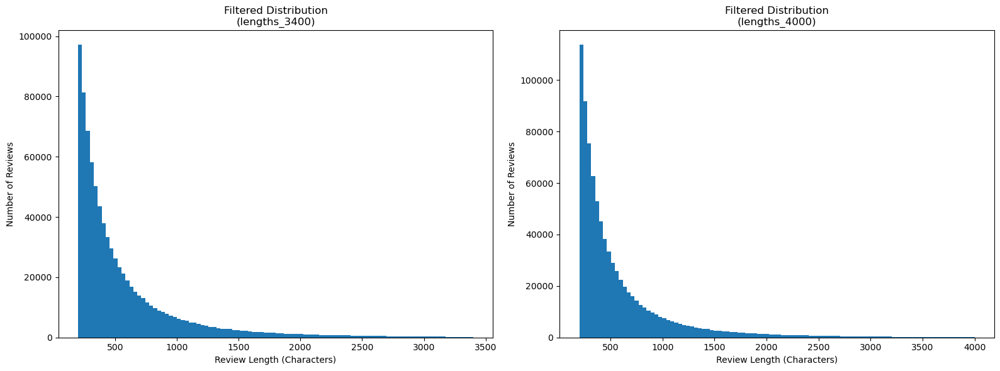

<p align="center">
  
</p>

<h1 align="center">Amazon Review Sentiment Analysis</h1>

<p align="center">
  End-to-end exploration, aspect-based satisfaction analysis, and five-star rating prediction from Amazon electronics reviews.
</p>

<p align="center">
  
  
  
  
</p>

## Overview

This project studies a large collection of Amazon electronics reviews and builds models that predict a reviewer's exact product rating from **1 to 5 stars**. It combines three complementary stages:

1. **Exploratory data analysis** — rating imbalance, word clouds, reviewer helpfulness, review length, popular products, and brand-level statistics.
2. **Aspect-based satisfaction analysis** — Word2Vec-based discovery of warranty-related terms followed by product-level warranty satisfaction scoring.
3. **Rating prediction** — Transformer-safe preprocessing, balanced sampling, RoBERTa LoRA and full fine-tuning experiments, ordinal-aware learning, validation diagnostics, and Kaggle-ready test submission.

The repository contains the notebooks and saved notebook outputs used for the analysis. Large raw datasets, trained model weights, and Kaggle working artifacts are intentionally kept outside Git.

## Problem Definition

Given the text of an Amazon review, predict the original `overall` rating:

| Label | Meaning |
|:---:|---|
| 1 | Very dissatisfied |
| 2 | Dissatisfied |
| 3 | Neutral or mixed |
| 4 | Satisfied |
| 5 | Very satisfied |

For exploratory sentiment visualizations, ratings are also grouped as follows:

| Ratings | Sentiment group |
|:---:|---|
| 1–2 | Negative |
| 3 | Neutral |
| 4–5 | Positive |

The official evaluation metric is **micro-averaged F1**. For single-label multiclass classification, micro-F1 is equivalent to accuracy.

## Dataset

The training set contains **838,944 reviews** with 11 columns:

| Column | Description |
|---|---|
| `overall` | Product rating from 1 to 5; training target |
| `vote` | Helpful-vote count |
| `verified` | Whether the purchase was verified |
| `reviewTime` | Human-readable review date |
| `reviewerID` | Reviewer identifier |
| `asin` | Amazon product identifier |
| `style` | Product attributes such as size or color |
| `reviewerName` | Display name of the reviewer |
| `reviewText` | Full review text; required model input |
| `summary` | Short review title or summary |
| `unixReviewTime` | Review timestamp in Unix format |

A separate metadata table maps each `asin` to a product title and brand. The unlabeled test set contains 20,000 rows and preserves the same review fields except for `overall`.

Dataset download links are listed in [`data/raw/dataset_link.txt`](data/raw/dataset_link.txt). After downloading, place the files under `data/raw/`:

```text
data/raw/
├── train_data.csv
├── test_data.csv
└── title_brand.csv
```

## Exploratory Analysis

### Rating imbalance

The raw training distribution is strongly skewed toward five-star reviews:

| Rating | Reviews | Share |
|:---:|---:|---:|
| 1 | 82,950 | 9.89% |
| 2 | 56,756 | 6.77% |
| 3 | 81,239 | 9.68% |
| 4 | 156,514 | 18.66% |
| 5 | 461,485 | 55.01% |

<p align="center">
  
</p>

### Review length

Review length is highly right-skewed. The median review contains 408 characters, the mean is approximately 625, and 99% of reviews are shorter than about 3,400 characters. The analysis recommends truncation rather than discarding long reviews so that their information is retained.

<p align="center">
  
</p>

### Word clouds

Positive, neutral, and negative word clouds are generated after lowercasing, punctuation/number removal, and English stopword filtering. Positive reviews emphasize terms such as *works*, *great*, *quality*, and *recommend*, while negative reviews contain more problem-oriented language. Product nouns appear across all groups because customers discuss the same device categories from different perspectives.

<p align="center">
  
</p>

Additional Part 1 analyses include:

- Top reviewers by total helpful votes
- Top ten products by number of five-star reviews
- Top ten most-reviewed brands and their average ratings
- Original and outlier-filtered review-length histograms

The corresponding notebooks are available in [`notebooks/part1/`](notebooks/part1/).

## Warranty Satisfaction Analysis

Part 2 estimates product-level satisfaction with warranties:

1. Normalize review text and remove common English stopwords.
2. Train a Word2Vec model on the review corpus.
3. Retrieve terms semantically related to `warranty`, including spelling variants and related concepts such as `guarantee`, `warrantee`, `warrenty`, `warantee`, `squaretrade`, and `rma`.
4. Select reviews containing at least one warranty-related term.
5. Group the selected reviews by `asin` and calculate their mean `overall` rating.

<p align="center">
  
</p>

Implementation: [`notebooks/part2/Satisfaction-level-7.ipynb`](notebooks/part2/Satisfaction-level-7.ipynb).

## Rating-Prediction Pipeline

### Transformer-safe preprocessing

The Part 3 preprocessing pipeline deliberately keeps linguistic information that may affect sentiment:

- Remove HTML tags and URLs
- Normalize whitespace
- Preserve case, punctuation, numbers, emoji, stopwords, and negation
- Retain rows with missing helpful-vote counts and encode them as `missing`
- Bucket helpful votes into `missing`, `0_to_4`, `5_to_9`, `10_to_49`, and `50_plus`
- Limit the summary to 40 words
- Build a structured model input from verification status, helpful-vote bucket, summary, and review text

The current experiment samples 50,000 reviews per rating, then reserves 2,000 per class for validation:

| Split | Rows | Rows per class |
|---|---:|---:|
| Training | 240,000 | 48,000 |
| Validation | 10,000 | 2,000 |
| Processed test | 20,000 | Unlabeled |

### Model experiments

#### RoBERTa-base with LoRA

The LoRA experiment uses KerasHub's `roberta_base_en`, rank-16 low-rank adapters, sequence length 256, AdamW, mixed precision, warmup followed by cosine decay, early stopping, and resumable checkpoints.

#### Full RoBERTa with hybrid ordinal loss

The strongest completed model fine-tunes the full RoBERTa backbone and combines sparse categorical cross-entropy with an ordinal CDF-distance term. For long reviews, it retains both the beginning and ending of the text instead of using only the first tokens.

#### DeBERTa-v3 with LoRA

The repository also includes DeBERTa-v3 LoRA and timeout-resume notebooks. They define the complete training and recovery workflow, but no completed DeBERTa run or validation result is stored in the current repository.

## Results

Both completed RoBERTa experiments use the same balanced validation split.

| Model | Fine-tuning strategy | Trainable parameters | Validation micro-F1 | Validation macro-F1 |
|---|---|---:|---:|---:|
| RoBERTa-base LoRA, rank 16 | Parameter-efficient | 4,176,389 (3.26%) | 0.6748 | 0.6751 |
| **RoBERTa-base Full + Ordinal** | **Full backbone** | **124,647,173 (100%)** | **0.6948** | **0.6960** |

Per-class F1 for the best completed model:

| Rating | Precision | Recall | F1 |
|:---:|---:|---:|---:|
| 1 | 0.7659 | 0.7410 | 0.7532 |
| 2 | 0.5848 | 0.6395 | 0.6109 |
| 3 | 0.6190 | 0.6215 | 0.6203 |
| 4 | 0.6891 | 0.6605 | 0.6745 |
| 5 | 0.8310 | 0.8115 | 0.8211 |

The full ordinal model improves validation micro-F1 by 2 percentage points over LoRA and performs best on the two extreme ratings. Ratings 2–4 remain more difficult because adjacent star ratings often express overlapping language.

> **Evaluation note:** these scores come from an artificially balanced validation split. A second validation set that preserves the raw rating distribution is recommended before interpreting the score as expected production or leaderboard performance. Text-level grouping should also be used when splitting future datasets to prevent repeated review text from appearing in both training and validation.

## Submission

The inference notebooks restore the saved model, reproduce its validation score, preserve test-row order, generate label-free diagnostics, and write the required file:

```text
q2_submission.csv
└── predicted    # one integer rating from 1 to 5 per test row
```

The strongest completed submission is generated by:

[`notebooks/part3/roberta_full_test_inference_submission.ipynb`](notebooks/part3/roberta_full_test_inference_submission.ipynb)

Model weights and generated submissions are Kaggle artifacts and are not committed because of their size.

## Repository Structure

```text
.
├── assets/                     # README banner
├── data/
│   ├── raw/                    # Dataset links; downloaded CSVs are ignored
│   └── processed/              # Locally generated processed data
├── notebooks/
│   ├── part1/                  # Six exploratory-analysis tasks
│   ├── part2/                  # Warranty satisfaction analysis
│   └── part3/                  # EDA, preprocessing, training, resume, inference
├── reports/                    # Exported charts and word clouds
├── src/                        # Reusable loading, cleaning, splitting, and TF-IDF utilities
├── requirments.txt             # Current local dependency list
├── LICENSE
└── README.md
```

## Getting Started

### 1. Clone the repository

```bash
git clone <repository-url>
cd amazon-review-sentiment-analysis
```

### 2. Create an environment

```bash
python -m venv .venv
```

Activate it on Linux or macOS:

```bash
source .venv/bin/activate
```

Activate it on Windows PowerShell:

```powershell
.venv\Scripts\Activate.ps1
```

### 3. Install dependencies

```bash
pip install -r requirments.txt
pip install keras-hub seaborn beautifulsoup4 joblib gensim
```

The second command installs packages used by the advanced notebooks and reusable utilities that are not yet included in the base dependency file.

### 4. Download the data

Use the links in [`data/raw/dataset_link.txt`](data/raw/dataset_link.txt), then place the three CSV files under `data/raw/` as shown in the Dataset section.

### 5. Run the notebooks

For local EDA:

```bash
jupyter notebook
```

Run the Part 3 workflow in this order:

1. `notebooks/part3/eda.ipynb`
2. `notebooks/part3/preprocessing_kaggle.ipynb`
3. `notebooks/part3/roberta_keras_lora.ipynb` or `roberta_keras_full_ordinal.ipynb`
4. The matching test-inference notebook

The Transformer notebooks are designed for Kaggle GPU sessions. Update the configuration cells if your Kaggle dataset or model slugs differ from the paths saved in the executed notebooks.

## Reproducibility

- Global random seed: `42`
- Deterministic TensorFlow operations enabled
- Stratified, fixed-size validation split
- Fixed sequence length of 256 tokens
- Saved best and periodic checkpoints
- `BackupAndRestore` support for interrupted Kaggle sessions
- Validation-score reproduction before test inference
- Test order and submission-schema assertions

Exact reproduction also requires the same Kaggle dataset version, Keras/KerasHub version, pretrained-model preset, and GPU environment used by the saved notebook runs.

## Limitations and Next Steps

- Create train/validation splits grouped by normalized review-text hash to eliminate text-level leakage.
- Evaluate the selected model on a validation set with the original class distribution.
- Compare balanced sampling with class-weighted training on all available reviews.
- Complete and benchmark the DeBERTa-v3 experiment.
- Consolidate duplicated notebook logic into the reusable `src/` package.
- Add pinned dependencies and automated tests for preprocessing and submission integrity.
- Explore probability calibration or prior correction if the hidden test distribution follows the raw training distribution.

## Contributing

Contributions are welcome. Please read [`.github/CONTRIBUTING.md`](.github/CONTRIBUTING.md) and use the pull-request template when proposing changes.

## Security

Please report security issues according to [`.github/SECURITY.md`](.github/SECURITY.md).

## License

This project is available under the [MIT License](LICENSE).
